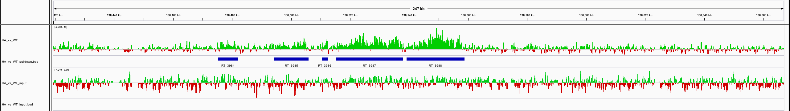

## Preprocessing

### Nucleotide-encoded single-end
```sh
INDIR="/path/to/fastq/files"
OUTDIR="$HOME/prepro"
PREFIX="mySample_A"
FASTQFILE="${PREFIX}_R1.fastq.gz"
./preprocessIlluminaFastq_SE.sh -t 14 $INDIR $OUTDIR $PREFIX $FASTQFILE
```

### Nucleotide-encoded paired-end
```sh
INDIR="/path/to/fastq/files"
OUTDIR="$HOME/prepro"
PREFIX="mySample_A"
FASTQFILE="${PREFIX}_R1.fastq.gz"
FASTQFILEREVERSE="${PREFIX}_R2.fastq.gz"
./preprocessIlluminaFastq_PE.sh -t 14 $INDIR $OUTDIR $PREFIX $FASTQFILE $FASTQFILEREVERSE
```

## Remove contaminations

### Nucleotide-encoded single-end
```sh
INDIR="$HOME/prepro"
OUTDIR="$HOME/prepro"
PREFIX="mySample_A"
FASTQFILE="${PREFIX}.tr.fi.fq.gz"
BA_INDEX="/path/to/all/bacteria/bowtie2/index"
FU_INDEX="/path/to/all/fungi/bowtie2/index"
PR_INDEX="/path/to/all/protozoa/bowtie2/index"
./removeContaminationIllumina.sh -t 14 $INDIR $OUTDIR $PREFIX $FASTQFILE $BA_INDEX $FU_INDEX $PR_INDEX
```

### Nucleotide-encoded paired-end
```sh
INDIR="$HOME/prepro"
OUTDIR="$HOME/prepro"
PREFIX="mySample_A"
BA_INDEX="/path/to/all/bacteria/bowtie2/index"
FU_INDEX="/path/to/all/fungi/bowtie2/index"
PR_INDEX="/path/to/all/protozoa/bowtie2/index"
for ENDING in R1_paired R1_unpaired R2_paired R2_unpaired
do EXTPREFIX="${PREFIX}_${ENDING}"
FASTQFILE="${EXTPREFIX}.tr.fi.fq.gz"
./removeContaminationIllumina.sh -t 14 $INDIR $OUTDIR $EXTPREFIX $FASTQFILE $BA_INDEX $FU_INDEX $PR_INDEX
done

# one needs to re-pair the files after filtering
# just as a warning: my implementation is horribly inefficient
sudo cp ./mergeAndSortSplitPEreads.py /usr/local/bin/
sudo chmod 755 /usr/local/bin/mergeAndSortSplitPEreads.py
INDIR="$HOME/prepro"
OUTDIR="$HOME/prepro"
PREFIX="mySample_A"
FASTQFILE="${PREFIX}_R1_paired.noCont.fq.gz"
FASTQFILEREVERSE="${PREFIX}_R2_paired.noCont.fq.gz"
./mergeAndSortSplitPEreads.sh $INDIR $OUTDIR $PREFIX $FASTQFILE $FASTQFILEREVERSE
```

## Check the read numbers after the preprocessing

### Single-end reads
```sh
ALLSAMPLES=("mySample_A" "mySample_B")
READS="/path/to/fastq/files"
for PREFIX in "${ALLSAMPLES[@]}"
do echo $PREFIX >> readCountsX4.txt
zcat $READS/${PREFIX}_R1.fastq.gz | wc -l >> readCountsX4.txt
zcat $READS/${PREFIX}.tr.fq.gz | wc -l >> readCountsX4.txt
zcat $READS/${PREFIX}.tr.fi.fq.gz | wc -l >> readCountsX4.txt
zcat $READS/${PREFIX}.noCont.fq.gz | wc -l >> readCountsX4.txt
done
awk '{printf "%s\t", $0; if (NR%5==0) {printf "\n"}}' readCountsX4.txt > readCountsX4wide.txt
# note that the numbers have to be devided by 4!
```

### Paired-end reads
```sh
```

## Align reads

### DNA-Seq single-end (only unique alignments)
```sh
INDIR="$HOME/prepro"
OUTDIR="$HOME/prepro"
PREFIX="mySample_A"
FASTQFILE="${PREFIX}.noCont.fq.gz"
GENOME_INDEX="/path/to/a/genome/bowtie2/index"
./alignIlluminaWithBowtie2_SE.sh -t 14 $INDIR $OUTDIR $PREFIX $FASTQFILE $GENOME_INDEX
```

### DNA-Seq paired-end (only unique alignments)
```sh
INDIR="$HOME/prepro"
OUTDIR="$HOME/prepro"
PREFIX="mySample_A"
FASTQFILE="${PREFIX}_R1.repaired.fq.gz"
FASTQFILEREVERSE="${PREFIX}_R2.repaired.fq.gz"
GENOME_INDEX="/path/to/a/genome/bowtie2/index"
./alignIlluminaWithBowtie2_PE.sh -t 14 $INDIR $OUTDIR $PREFIX $FASTQFILE $FASTQFILEREVERSE $GENOME_INDEX
```

### RNA-Seq single-end
Subjunc, per default with up to 10 alignments per read. If only unique, then add --unique.
```sh
INDIR=""
OUTDIR=""
PREFIX=""
FASTQFILE=""
GENOME_INDEX="/path/to/a/genome/subread/index"
./alignWithSubjunc_SE.sh -t 14 $INDIR $OUTDIR $PREFIX $FASTQFILE $GENOME_INDEX
```

### RNA-Seq paired-end
Subjunc, per default with up to 10 alignments per read. If only unique, then add --unique.
```sh
INDIR=""
OUTDIR=""
PREFIX=""
FASTQFILE=""
FASTQFILEREVERSE=""
GENOME_INDEX="/path/to/a/genome/subread/index"
./alignWithSubjunc_PE.sh -t 14 $INDIR $OUTDIR $PREFIX $FASTQFILE $FASTQFILEREVERSE $GENOME_INDEX
```

## Bam to bigWig conversions (for genome-browsers)

### Regular bigWig
```sh
INDIR=""
OUTDIR=""
PREFIX=""
BAMFILE=""
./bamToBigWig.sh $INDIR $OUTDIR $PREFIX $BAMFILE
```

### Normalized bigWig
I'm a bit sceptical about those - I have the feeling that the normalization is prone to outliers. Customers really like them though...
```sh
INDIR=""
OUTDIR=""
PREFIX=""
BAMFILE=""
MAPPABLE_GENOME="2150570000" # that's for example mm9 - see help
./bamTo1xNormalizedBigWig.sh-t 14 $INDIR $OUTDIR $PREFIX $BAMFILE $MAPPABLE_GENOME
```

## ChIP-Seq

### Quality-check with Phantompeakqualtools
```sh
INDIR=""
OUTDIR=""
PREFIX=""
BAMFILE=""
./ChIPseq_ppqt.sh -t 14 $INDIR $OUTDIR $PREFIX $BAMFILE
```

### Peak identification with MACS2
```sh
INDIR=""
OUTDIR=""
PREFIX=""
BAMFILE=""
BAMFILECONTROL="" # optional
MAPPABLE_GENOME="mm" # can also be a number - check help of macs2
./ChIPseq_macs.sh -t 14 [-c $BAMFILECONTROL] $INDIR $OUTDIR $PREFIX $BAMFILE $MAPPABLE_GENOME
# Note: for easier handling of project with and without controls, a $BAMFILECONTROL file starting with "none" will be ignored.
```

### Peak identification with SICER
```sh
INDIR=""
OUTDIR=""
PREFIX=""
BAMFILE=""
BAMFILECONTROL="" # optional
./ChIPseq_sicer.sh -t 14 [-c $BAMFILECONTROL] $INDIR $OUTDIR $PREFIX $BAMFILE
```

### Peak identification with home-made Runs-Test
There is absolutely no warranty for this approach. It may only be used with very broad and diffuse signals. It essentially takes the difference between two normalized bigWigs and searches for significant streches with only negative or positive values. I included an example figure at the bottom.
```sh
sudo cp ./runsTestChXPseq.py /usr/local/bin/
sudo cp ./processChXPrunsTest.R /usr/local/bin/
sudo chmod 755 /usr/local/bin/runsTestChXPseq.py
sudo chmod 755 /usr/local/bin/processChXPrunsTest.R
INDIR=""
OUTDIR=""
PREFIX=""
BIGWIGTESTFILE="" # needs to be normalized
BIGWIGCONTROLFILE="" # needs to be normalized
./ChIPseq_runsTest.sh -t 14 [-c $BAMFILECONTROL] $INDIR $OUTDIR $PREFIX $BAMFILE
```

### Count reads per region - THIS IS NOT FOR RNA-SEQ!
```sh
INDIR=""
OUTDIR=""
PREFIX=""
PEAKFILE=""
# few bam files:
BAMDIR="/path/to/bam/files"
./countReadsPerFlatRegion.sh -t 14 $INDIR $OUTDIR $PREFIX $PEAKFILE $BAMDIR/mySample_A.bam $BAMDIR/mySample_B.bam

# many bam files:
BAMDIR="/path/to/bam/files"
./countReadsPerFlatRegion.sh -t 14 $INDIR $OUTDIR $PREFIX $PEAKFILE $BAMDIR/*.bam
```

## Figures


**Figure 1:** Example illustrating the custom-made Runs-Test.
